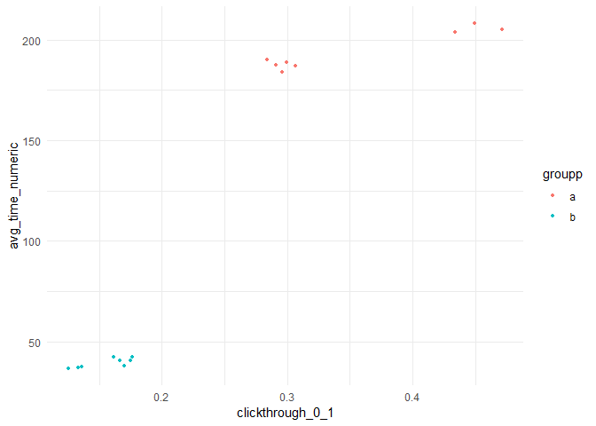

<p align="justify">
 
## Summary and Highlights

Behaviour of **customer has been analyzed on 2 different groups of visitors for 1week and half**, the main conclusions are:

- It is clear that **group A has a healthier user experience**, in which the user tends to find more content they like but not better empty Searches rate, as explained in this report further. 

- It has been **prioritized the relationship between Avg Time Spent per Session vs other metrics**. **Clicktrhough** at the day and group level has been **the most relevant**. Since no pattern can be clearly stated on a session level, as explained further, the **report has focused on treating info aggr to day and group granularity**.

Avg Session Time Spent has been the relevant metric studied; as the overall time spent in all sessions (sum) would obviously be proportionate very well with num. sessions / or any other positive metric on user journey.

```{r echo=FALSE}

```

In the image every dot represents on day-group combination, based on data provided we **  relationship between Clickthrough rate (day and group) vs Avg Time Spent / session can be extrapolated**. 

- In regard of **zero results searches**, as mentioned, **there is no different between groups**. Same as the metric of  **result first position clicked**, which is very much **similar between groups**, and not really unnatural (users tend to click, in both groups, way more 1st and 2nd results than any other). 

## Study storyline and questions:


The following extended report is answering the following questions (in different sections) arised by managers:

1. What is our daily overall clickthrough rate? How does it vary between the groups?
2. Which results do people tend to try first? How does it change day-to-day?
3. What is our daily overall zero results rate? How does it vary between the groups?
4. Let session length be approximately the time between the first event and the last event in a session. Choose a variable from the dataset and describe its relationship to session length. Visualize the relationship.
    
There is also an Annex explaining the different more technical conclusions over the discovery of the dataset, which is not that relevant business wise, but has been part of the task in order to assess conclucions. 

All answers are correctly answered throughout the following report, setting them up as well as a story so that it can be better understood. 

## Project Summary

** (for readability porpuses, all code has been echoed here, so the technical reviewers can understand better the development as well as follow story line, and business details take longer to see but are still the main porpuse) **

```{r message=FALSE, warning=FALSE}
##  Libraries:

if(require("pacman")=="FALSE"){
    install.packages('pacman')
 } 

library('pacman')
pacman::p_load(readr, caret, plotly, ggplot2, 
               labeling, promises, ggridges, 
               mlbench, inum, e1071, 
               corrplot, ggpubr, rpart
               , rpart.plot, gbm,boot,dplyr,
               reshape, Rserve, tidyverse, padr
               , sqldf, lubridate,knitr)
  


## Setup environment and Global options
options(max.print="150")
knitr::opts_chunk$set(echo=TRUE,
	             cache=TRUE,
               prompt=FALSE,
               tidy=TRUE,
               comment=NA,
               message=FALSE,
               warning=FALSE)
path <- getwd()
knitr::opts_knit$set(root.dir = normalizePath(path.expand(path),
                                             winslash = ("/"),
                                             mustWork = TRUE))
knitr::opts_knit$set(width=75)

```

After loading libraries, let's start by loading the dataset. At this point, several things have been encountered in the format of the dataset, they are refered in annex.

At the moment, the load of the file already includes 1st processing of the file so that is the more treatable.

</p>

```{r eval=TRUE, warning=FALSE}

## pending to change and get data from here + decompress it.: 
https://github.com/wikimedia-research/Discovery-Hiring-Analyst-2016/blob/master/events_log.csv.gz

#### Load Data & 1st Processing ####
eventsDf <- read.csv("events_log.csv"
         , header = T, sep = ","
         ) %>%  
  mutate(timestamp_chr = as.character(timestamp))  %>% 
  mutate(timestamp_chr = gsub("[.]","", gsub("e[+]13","000000", as.character(timestamp_chr))) ) 

#### Preprocessing ####
colnames(eventsDf)[4] <- "groupp"   # changed to avoid keyword misunderstandings with R coding
eventsDf$datetime <- as.POSIXct(strptime(eventsDf$timestamp_chr, f <- "%Y%m%d%H%M%S", tz = "GMT")
                                )

#remove those 2 columns afterwards for practicity.
eventsDf$timestamp_chr <- NULL
eventsDf$timestamp <- NULL

```


At this point, an analysis on the different relation of the following attributes is done: uuid, session_id, page_id. But included in the annex. Main conclusions are:

- Based on questions proposed for the exercise, at least 3 out of 4 questions proposed rely on Session behaviour and metrics calculated to this level, so one can look at the information on this granularity level.

- The remaining question, which is the one regarding the 1st clicked result by the user (question 2.) is left to the end of the report, for practical and relevancy porpuses, since it has to do with a visit (1st) level, and another dataframe is created for that porpuse.

So, to address 3 out of 4 questions we create a dataframe to session level (sessionsDf)

```{R warning=FALSE }
####  Sessions Datafram ####
sessionsDf <- 
eventsDf %>%  select(-uuid) %>% #filter(action %in% c("visitPage","checkin","searchResultPage"))   %>%
 mutate(n_results =  case_when((action == "searchResultPage" ) ~ as.numeric(n_results), TRUE ~ 0)   

        ,is_visit = case_when(action == "visitPage" ~ 1, TRUE ~ 0) 
        ,is_zeroResSearch =  case_when((action == "searchResultPage" & n_results == 0) ~ 1, TRUE ~ 0) 
        ,is_nonZeroResSearch =  case_when((action == "searchResultPage" & n_results > 0) ~ 1, TRUE ~ 0) 
 ) %>% #na.omit() %>% #not needed anymore, handled the tipographicaly incorrect dates.
  group_by(session_id, groupp)  %>% 
  summarize(
           n_results = sum(n_results)
           ,datetime_min = min(datetime) 
           ,datetime_max = max(datetime)
           #result_position = max(result_position), will be calculated directly in eventsDF
           ,num_visit = sum(is_visit)
           ,num_searches_zero_res = sum(is_zeroResSearch)
           ,num_searches_nonzero_res = sum(is_nonZeroResSearch)
           ) %>% ungroup() %>% mutate(time_in_session = datetime_max - datetime_min) 

```


Below we include all relevant metrics for analysis + datetime detail (week/day) refered to session start time (so we make sure a session always belong to only one day, and we do not replicate):


```{R warning=FALSE }

# sessions may be between 2 days, to avoid this, 
#we set up the reference of the date to the datetime_min.
sessionsDf$wday <- wday(sessionsDf$datetime_min) - 1  
# move sunday to last day of week
sessionsDf <- mutate(sessionsDf,wday = case_when(wday == 0 ~ 7, TRUE ~ wday)) 
# move sunday to last day of week
sessionsDf$day <- day(sessionsDf$datetime_min) 

#eventsDf$week <- week(eventsDf$datetime) 
sessionsDf <- mutate(sessionsDf,week = case_when(day > wday + 4 ~ 10, TRUE ~ 9))

sessionsDf <- mutate(sessionsDf,wday_label = case_when(wday == 1 ~ 'Monday',
                                                   wday == 2 ~ 'Tuesday',
                                                   wday == 3 ~ 'Wednesday',
                                                   wday == 4 ~ 'Thursday',
                                                   wday == 5 ~ 'Friday',
                                                   wday == 6 ~ 'Saturday',
                                                   wday == 7 ~ 'Sunday'
)
)

#checking out day assignment is correct.
sessionsDf %>% group_by(week,day,wday,wday_label) %>% summarize(n = n())

```

Having looked at the calendar, in the result above we make sure weekday and week are correctly assigned: 1st march 2016 was tuesday (day attribute tells day of the month), Can see this corresponds to results above. In order to do day to day analysis will do it based on weekNumb + wday, which may end up being more relevant in order to find eventual (weekend or similar) patterns.

Let's now focus on the business questions:

### 1. ClickThrough Rate on day to day / group:

```{R warning=FALSE}
#### calculation of clickthrough rate #### 

#lets define aggregation level to be used in sqldf: 
aggr_ClickThru_attribs <- "\n week 
                             , wday_label
                             , wday
                             , groupp"

# as well as metrics: 
num_searches <- "\n ,(sum(num_searches_nonzero_res + num_searches_zero_res)) as num_searches "
num_visit <- "\n ,sum(num_visit) as num_visit "
clickthrough_0_1 <- "\n ,cast(sum(num_visit) as real) / (sum(num_searches_nonzero_res + num_searches_zero_res)) as clickthrough_0_1 "


ClickthrouRateDf <- sqldf( 
  paste("SELECT 'dummy'  as dummy ,
        ", aggr_ClickThru_attribs 
       , num_searches 
        , num_visit
        , clickthrough_0_1 , "
        FROM sessionsDf   
        group by "
        ,aggr_ClickThru_attribs
        ,sep=""
        )
  )

```

Throughout all exercise, this technique of agg level and metrics calculation is used, so will reuse those variables later on for easier employment, and also allow for future addons on possible modifications.


```{R  }
## viz for finding out different between clickthrough rates, daybyday

ggplot(ClickthrouRateDf) +
  aes(x = wday, y = clickthrough_0_1, colour = groupp) +
  scale_x_discrete(limits=(ClickthrouRateDf %>% select(wday) %>% unique() %>% arrange(wday))$wday
                ) +
  geom_point(size = 1L) +
  scale_color_hue() +
  theme_minimal() +
  facet_wrap(vars(week), labeller = "label_both")

```

The group A has significantly more clickthrough rate, Group A has clearly better behaviour on the search funnel. 

### 3. Daily overall 0 results (searches) rate:


```{R  }

zeroResults_rate <- "\n ,cast(sum(num_searches_zero_res) as real) / (sum(num_searches_nonzero_res + num_searches_zero_res)) as zeroResults_rate " 
zeroResults <- "\n ,cast(sum(num_searches_zero_res) as real) as zeroResults "
nonZeroResults <- "\n ,sum(num_searches_nonzero_res)  as nonZeroResults "

ZeroResultsRateDf <- sqldf( 
  paste("SELECT 'dummy'  as dummy ,
        ", aggr_ClickThru_attribs
        , zeroResults_rate 
        , zeroResults
        , num_searches , "
        FROM sessionsDf   
        group by "
        ,aggr_ClickThru_attribs
        ,sep=""
  )
)

#falta la vizzzz
ggplot(ZeroResultsRateDf) +
  aes(x = wday, y = zeroResults_rate, colour = groupp) +
    geom_line(size = 1L) + #limits=(ClickthrouRateDf %>% select(wday) %>% unique() %>% arrange(wday))$wday
             #   ) +
  scale_color_hue() +
  theme_minimal() +
  facet_wrap(vars(week), labeller = "label_both")


```

As can be seen, the scale of the graph is very accurate, and the zeroResults rates move between 0,17 - 0,20 rates. For both groups, and days do not represent big changes. This is not a relevant metric to differenciate behaviour between groups A and B, neither gives any extra relevant information. 

### 4. Sessions time analysis:

After trying to plot directly the information of time (datetime_max - datetime_min) there are some huge values on the calculation that were minimized to 500segs, assuming this can be really a reasonable maximum of session time spent by a real user, or at least maximum tracking from the tool that tracks sessions on the website:


```{r }

sessionsDf <-  mutate(sessionsDf, time_numeric = case_when(          as.numeric(time_in_session)   > 500 ~ 500, TRUE ~ as.numeric(time_in_session)) 
                      ) 

```

Below are the metric definitions + aggreg level (session level first).

```{R }


#metric definitions for time analysis.
time_numeric <-  "\n ,sum(time_numeric) as time_numeric "
n_results <- "\n ,sum(n_results) as n_results "  #number results appeared in search
num_sessions <- "\n ,count() as num_sessions "

Noaggr_ClickThru_attribs <- "\n week
                             , wday_label
                             , wday
                             , groupp
                             , session_id"

sessionsDf2 <- sqldf( 
  paste("SELECT 'dummy'  as dummy ,
        ", Noaggr_ClickThru_attribs
        , zeroResults_rate 
        , zeroResults
        ,num_visit
        , num_searches 
        ,num_sessions
        ,time_numeric
        ,n_results
        ,zeroResults
        ,nonZeroResults
        ,clickthrough_0_1,"
        FROM sessionsDf   
        group by "
        ,Noaggr_ClickThru_attribs
        ,sep=""
  )
) %>% mutate(avg_visits_session = num_visit/ num_sessions
             ,avg_results_session = n_results/ num_sessions
             ,avg_searches_session = num_searches/ num_sessions
             ,avg_num_searches_nonzero_res = nonZeroResults / num_sessions
             ,avg_num_searches_zeroResults = zeroResults / num_sessions
             ,avg_time_numeric = time_numeric / num_sessions
              ,avg_clickthrough = clickthrough_0_1 / num_sessions
             )


CMatrix <- #cor(sessionsDf)
cor(sessionsDf2[
grep("avg_",colnames(sessionsDf2))
]
)
corrplot(CMatrix)


```


Corr. Matrix is poor against the time_spent, visits is the most relevant metric, but still not strongly correlated to time spent. Other graphs have been done in this sense, and no strong behaviour could be infered. 

Since is more practical to correlate info on aggregated level, and look at specific sessions. Will look for clearer patterns.

In this sense, and only on an aggregated level, do to the fact that on session basis this cannot be modeled. The relationship between time spent and results obbeys to a linear regression on a total basis aggregated to group, day.


``` {r warning=FALSE }


aggr_ClickThru_attribs <- "\n week
                             , wday_label
                             , wday
                             , groupp"

AggTimeDf <- sqldf( 
  paste("SELECT 'dummy'  as dummy ,
        ", aggr_ClickThru_attribs
        , zeroResults_rate 
        , zeroResults
        ,num_visit
        , num_searches 
        ,num_sessions
        ,time_numeric
        ,n_results
        ,zeroResults
        ,nonZeroResults
        ,clickthrough_0_1,"
        FROM sessionsDf   
        group by "
        ,aggr_ClickThru_attribs
        ,sep=""
  )
) %>% mutate(avg_visits_session = num_visit/ num_sessions
             ,avg_results_session = n_results/ num_sessions
             ,avg_searches_session = num_searches/ num_sessions
             ,avg_num_searches_nonzero_res = nonZeroResults / num_sessions
             ,avg_num_searches_zeroResults = zeroResults / num_sessions
             ,avg_time_numeric = time_numeric / num_sessions
              ,avg_clickthrough = clickthrough_0_1 / num_sessions
             )


#ploting of results and Time Spent.
ggplot(AggTimeDf) +
 aes(x = n_results, y = time_numeric, colour = groupp) +
 geom_point(size = 1L) +
 scale_color_hue() +
 theme_minimal()


```


Here can be seen relationship between total time spent and total number of results shown to user. Even though this relationship between results seems clear, we will go further, since:
The more results, obviously the more sesisons, and thus more time spent in total. This graph is no discovery in this sense. Let's analyze the avg_time_spent per session instead, that's a more interesting metric to analyze or find out about its behaviour.


``` {r warning=FALSE }

#ploting of results and Time Spent.

ggplot(AggTimeDf) +
 aes(x = clickthrough_0_1, y = avg_time_numeric, colour = groupp) +
 geom_point(size = 1L) +
 scale_color_hue() +
 theme_minimal()


```

  The graph above , included in the summary, basicaly states findings in terms of avg session time explanation.

After having played a bit with all those metrics, trying and see the info in detail as well (basic metrics).

A correlation between clickthroughs and time spent has been detected, specialy sepparating groups. This info can be clustered and seen evolve with following info. In any case, time spent is directly related to clickthrough (and thus visits/searches indirectly).

Would be recommmended at this point to see the performance of those metrics from now on, and try to find out about specific patterns that happen overtime.


### 2. 1st Results click behaviour: 

Last but not least,  the question regarding the first clicked results needs to be addressed..

First define a dataset that takes the first results vizualizations from user, since results is a number that can get to a reasonably big number: The biggest number was reduced to 100 as maximum clickable result, after seeing this is not a big number either. 


``` {r, echo=FALSE, results='asis'}

# first define a dataset that takes the first results vizualizations from user
firstClickedResult <- eventsDf %>% filter(action == "visitPage" )  %>% 
  #filter(session_id == "0007b7f6b575feb6") %>% 
  group_by(session_id) %>%    arrange(session_id,datetime) %>% 
  #filter(session_id == "0007b7f6b575feb6")  %>% 
  select(#datetime,
         groupp,session_id,result_position) %>% filter(row_number() == 1L) %>% #taking just the first row based on datetime.
  ungroup() %>% mutate(result_position = case_when(result_position < 100 ~ result_position, TRUE ~ as.integer(100)) )
         


ggplot(firstClickedResult) +
  aes(x = result_position) +
  geom_histogram(bins = 30L, fill = "#0c4c8a") +
  theme_minimal() +
  facet_wrap(vars(groupp))


```

It makes sense to do this graph smaller and cut out the clicked > 50 result positions as first click.

``` {r, echo=FALSE, results='asis'}

ggplot(firstClickedResult %>% filter(result_position < 15)
       ) +
  aes(x = result_position) +
  geom_histogram(bins = 30L, fill = "#0c4c8a") +
  theme_minimal() +
  facet_wrap(vars(groupp))


```

From results we can clearly see, for both groups, 1st position is the most clicked, while second already has < 50% clicks as the 1st. Same with 3rd and so on. No really much information to see from here. 


# Appendix:

## Information about the dataset that was granted. 

### Data

The dataset comes from a [tracking schema](https://meta.wikimedia.org/wiki/Schema:TestSearchSatisfaction2) that we use for assessing user satisfaction. Desktop users are randomly sampled to be anonymously tracked by this schema which uses a "I'm alive" pinging system that we can use to estimate how long our users stay on the pages they visit. The dataset contains just a little more than a week of EL data.

| Column          | Value   | Description                                                                       |
|:----------------|:--------|:----------------------------------------------------------------------------------|
| uuid            | string  | Universally unique identifier (UUID) for backend event handling.                  |
| timestamp       | integer | The date and time (UTC) of the event, formatted as YYYYMMDDhhmmss.                |
| session_id      | string  | A unique ID identifying individual sessions.                                      |
| group           | string  | A label ("a" or "b").                                     |
| action          | string  | Identifies in which the event was created. See below.                             |
| checkin         | integer | How many seconds the page has been open for.                                      |
| page_id         | string  | A unique identifier for correlating page visits and check-ins.                    |
| n_results       | integer | Number of hits returned to the user. Only shown for searchResultPage events.      |
| result_position | integer | The position of the visited page's link on the search engine results page (SERP). |

The following are possible values for an event's action field:

- **searchResultPage**: when a new search is performed and the user is shown a SERP.
- **visitPage**: when the user clicks a link in the results.
- **checkin**: when the user has remained on the page for a pre-specified amount of time.

### Example Session

|uuid                             |      timestamp|session_id       |group |action           | checkin|page_id          | n_results| result_position|
|:--------------------------------|:--------------|:----------------|:-----|:----------------|-------:|:----------------|---------:|---------------:|
|4f699f344515554a9371fe4ecb5b9ebc | 20160305195246|001e61b5477f5efc |b     |searchResultPage |      NA|1b341d0ab80eb77e |         7|              NA|
|759d1dc9966353c2a36846a61125f286 | 20160305195302|001e61b5477f5efc |b     |visitPage        |      NA|5a6a1f75124cbf03 |        NA|               1|
|77efd5a00a5053c4a713fbe5a48dbac4 | 20160305195312|001e61b5477f5efc |b     |checkin          |      10|5a6a1f75124cbf03 |        NA|               1|
|42420284ad895ec4bcb1f000b949dd5e | 20160305195322|001e61b5477f5efc |b     |checkin          |      20|5a6a1f75124cbf03 |        NA|               1|
|8ffd82c27a355a56882b5860993bd308 | 20160305195332|001e61b5477f5efc |b     |checkin          |      30|5a6a1f75124cbf03 |        NA|               1|
|2988d11968b25b29add3a851bec2fe02 | 20160305195342|001e61b5477f5efc |b     |checkin          |      40|5a6a1f75124cbf03 |        NA|               1|

This user's search query returned 7 results, they clicked on the first result, and stayed on the page between 40 and 50 seconds. (The next check-in would have happened at 50s.)

### Data analysis.

#### Errors reading dates: 

``` {r warning=FALSE }

head(
read.csv("events_log.csv"
         , header = T, sep = ","
         ) %>%   filter(uuid %in% c("6509e446fe7852fbb503af7d3453c6df","1a5b663f6a1258f588dc4de65c90b5c0", "deac7c11f00d598292f9e18ee2f6997f", "deac7a2afdff509ca7236907edb815e8")) %>% 
  mutate(timestamp_chr = as.character(timestamp)) 
)

```

As can be seen above, certain dates , whenever there were many 0s, it would just save it as +e13, which we manualy converted. 99% of the records com in correct format like: 20160308152022

There is only one record in the above that is loaded correctly, and we can assess this behaviour is due to different format recording, as can be seen below: 

``` {r warning=FALSE }

merge(
  read.csv("events_log.csv"
         , header = T, sep = ","
         ) %>% select(session_id,timestamp)
  ,
  eventsDf %>% filter(uuid %in% c("6509e446fe7852fbb503af7d3453c6df")) %>% select(session_id)
) %>% arrange(session_id,timestamp) %>%   mutate(timestamp_chr = as.character(timestamp))  


```

In the final row, one can see there is a shift in the day, which means the date would correspond to 20160306000000, which was typographicaly stored in the file as 2.0160306e+13 giving errors in the read, that's the reason for the preprocesing included.

#### Analyzing attribute relationship: 

Relationship between group and session is one to many, so no need to bother arround a session being in 2 different groups sametime, which is reasonable. In some parts of report it is seen the info is agregated to both session and group level, but in the end is about session level:


``` {r warning=FALSE }

#Attribute relation analysis and co.
eventsDf %>% select(groupp,session_id) %>% group_by(groupp,session_id) %>% summarize(n=n()) %>% ungroup() %>% filter (n>1) %>% group_by(session_id) %>% summarize(n2=n()) %>% filter (n2>1)

```

Regarding uuid,session_id and page: 

``` {r warning=FALSE }

#Attribute relation analysis and co.
eventsDf  %>% group_by(uuid) %>% summarize(n=n()) %>% filter (n>1)
#no dups for UUID, later will find out if this is going to be useful. 

dupVisitsDf <- 
eventsDf %>% select(-uuid) %>% filter(action == "visitPage") %>% unique() %>% group_by(session_id,page_id) %>% summarize(n=n()) %>% filter (n>1)
# there 2 duplicates in terms of page_id and visit, which is non-important in this sense. We can ignore this and actualy we end up counting visits directly on records that have this particular actions.

```

- UUID has no dups, in this case can't be used to relate between entities, but could be useful to count unique rows.

- There 2 duplicates in terms of page_id and visit, which is non-important in this sense. We can ignore this and actualy we end up counting visits directly on records that have this particular actions. (visits to session level for analytical porpuses)


``` {r warning=FALSE }

#Attribute relation analysis and co.

dupSearchesAndPageDf <- 
  eventsDf %>% filter(action == "searchResultPage") %>% select(session_id,action,page_id)  %>% group_by(session_id,page_id) %>% summarize(n=n()) %>% filter (n>1)

summary(dupSearchesAndPageDf)
#also duplicates on page_id for searches


#also duplicates on page_id for searches


```

- Regarding searches: We find even duplicates (n) on page and session comb., which is comprehensible. Regarding dups between searches and sessions is way worse but comprehensible: Conclusion, searches will be clearly analyzed at session level

